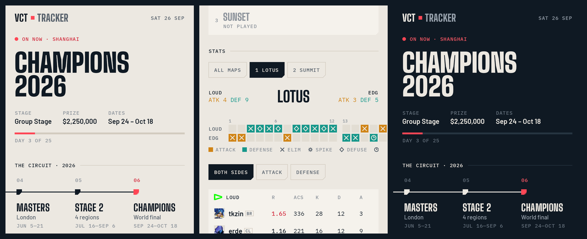
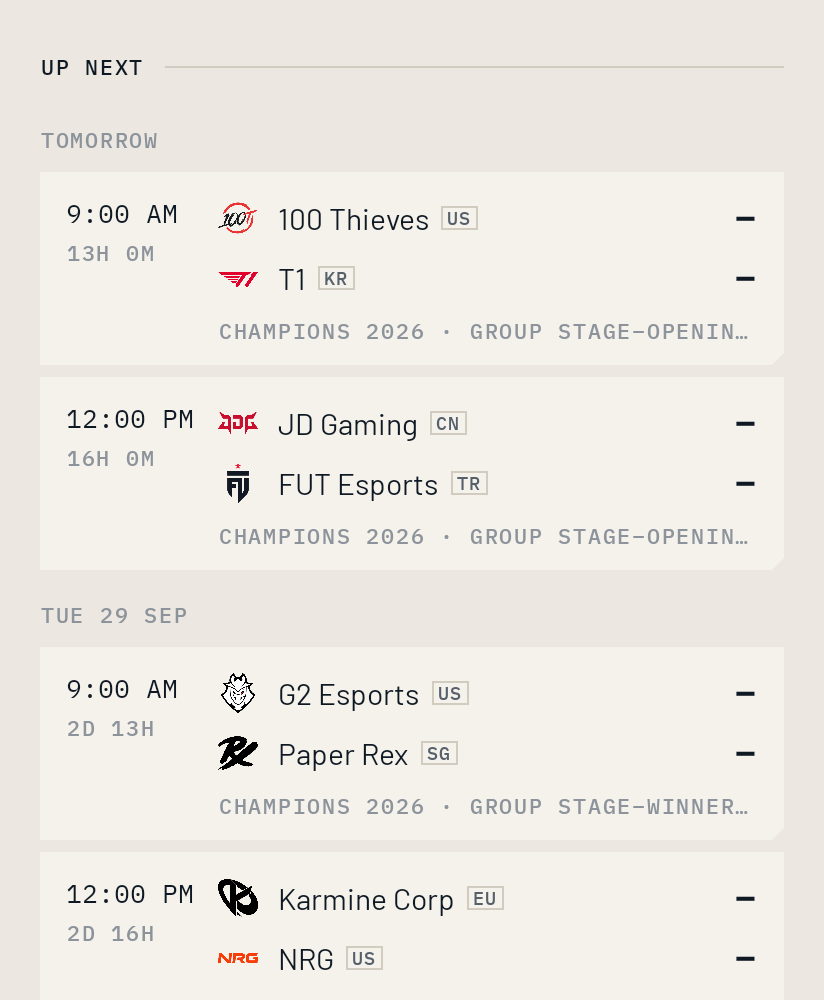
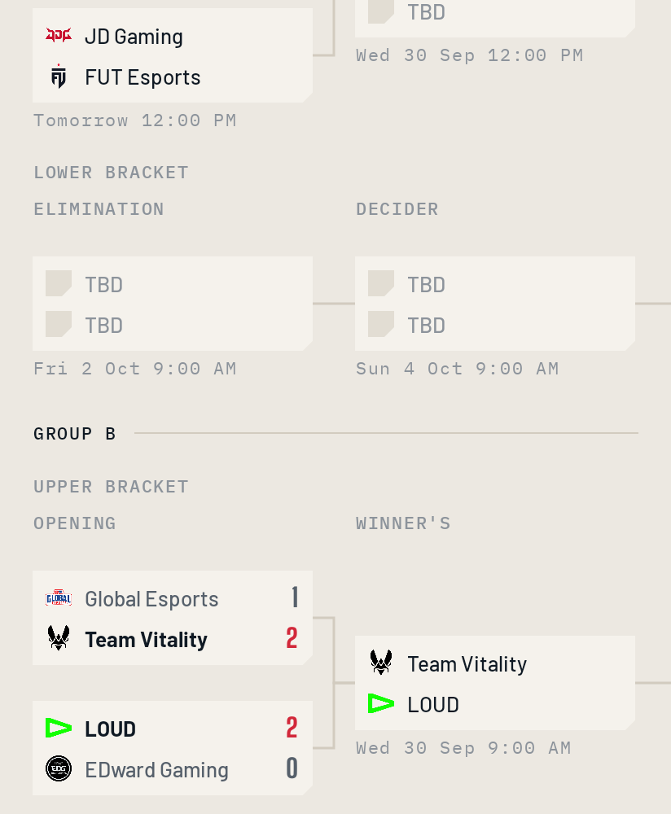
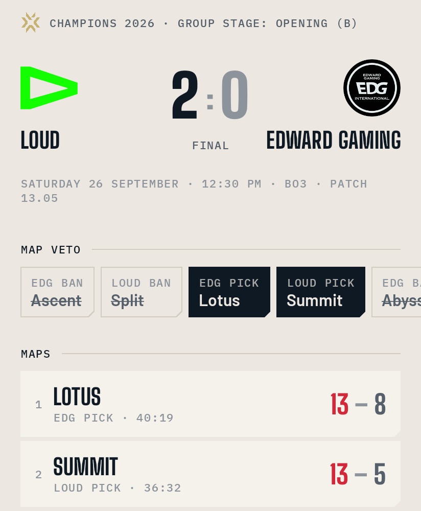
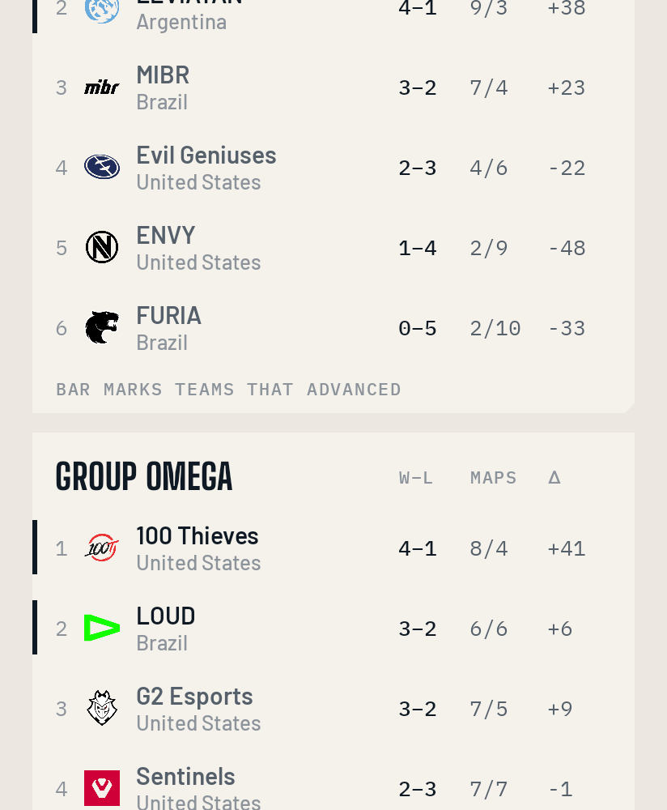
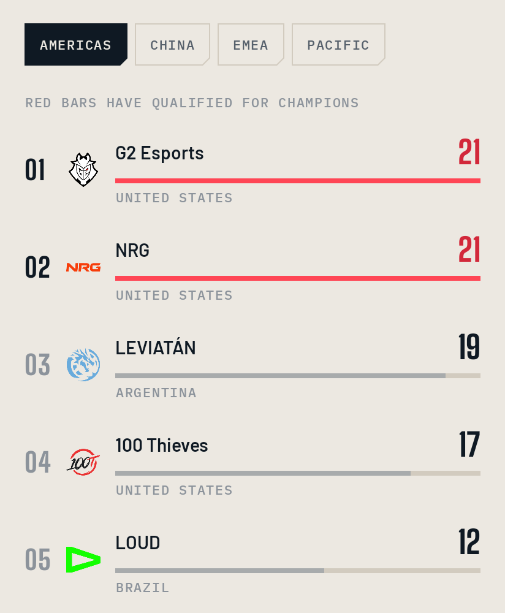
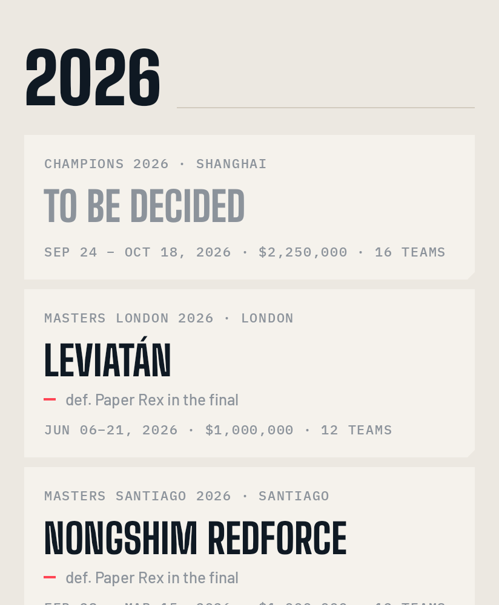

# VCT Tracker

An Android app for following the whole VALORANT Champions Tour: all four regional leagues (Americas, EMEA, Pacific, China), both Masters events, and Champions.

The app has no backend. It downloads pages from [vlr.gg](https://www.vlr.gg/vct) and [Liquipedia](https://liquipedia.net/valorant/VALORANT_Champions_Tour), parses them on the phone, and shows the results in its own interface.



## Install

Every push to `main` builds a new APK and publishes it on the [Releases page](../../releases/latest). Download `VCT-Tracker-1.0.N.apk` on your phone, open it, and allow installs from your browser when Android asks. You need Android 8.0 or newer.

## What's in it

**Today**
- The event that's on right now, with its stage, prize pool and how many days are left.
- The **Season Rail**, which shows the year's circuit in order: Kickoff → Masters → Stage 1 → Masters → Stage 2 → Champions. The current stop is marked. Tap a regional stop to see its four leagues.
- Live matches, which refresh every 30 seconds.
- Upcoming matches, grouped by day and shown in your local time with a countdown.
- Recent results. Only VCT matches are listed; Challengers and other events are filtered out.

**Events**
- Every VCT event for 2023–2026, filterable by region and grouped by stage.
- Brackets drawn with connector lines, for both upper and lower brackets.
- Group tables with W–L record, maps and round difference.
- Each event's full match list, prize distribution with circuit points, and team rosters.

**Match**
- A scoreboard header, the map veto (bans shown struck through, picks filled in), and a list of maps with who picked each one.
- A **round strip** for each map. The winning cell of every round is coloured by side (amber = attack, teal = defense) and marked with how the round ended: elimination, spike detonation, defuse or time.
- A player stats table (R, ACS, K/D/A, KAST, ADR, HS%, FK/FD) that you can switch between both sides, attack only and defense only. The top performer is highlighted.
- Stream and VOD links that open in Twitch or YouTube.

**Forecasts**
- Upcoming matches show each team's chance to win.
- The match page breaks the forecast down: the likely maps from a veto simulation, the win chance on each of them, and the main reasons in plain words.
- **Live forecasts:** once a match starts, the forecast updates with the maps already won and the live map's exact round score and sides.
- **Event forecasts:** each event has a Forecast tab with every team's chance to get out of each stage, to qualify for Masters or Champions, and to win the event. The rest of the event is simulated 2,000 times from where it stands, keeping results already in.
- A **Forecasts** screen shows how accurate the model has been on matches and events it never saw. The full backtest is in [docs/BACKTEST.md](docs/BACKTEST.md).

**Points**: circuit-point standings for each region, with the teams that qualified for Champions marked.

**History**: a hall of champions built from Liquipedia. Every Masters and Champions winner since 2021, plus the regional winners for each year.

**Team and player pages**: roster with photos, staff, last-five form, upcoming matches, results, agent stats and team history.

The app also:
- Follows the system light or dark theme.
- Works offline: every page is cached, and the app tells you when it's showing saved data.
- Supports pull-to-refresh.

<p>



</p>
<p>



</p>

## Design

The colours come from VALORANT itself:

| Colour | Hex | Used for |
|---|---|---|
| Bone | `#ECE8E1` | Light background ("paper") |
| Ink | `#0F1923` | Text; dark background |
| Spike red | `#FF4655` | Only "live" and "won" |
| Amber / teal | – | Only attack / defense |

Fonts:
- **Big Shoulders Display**: scores and titles (condensed, like a broadcast scorebug).
- **Barlow**: body text.
- **IBM Plex Mono**: labels and timestamps.

Panels have a clipped corner that echoes the in-game HUD. All icons are drawn for the app; it uses no emoji and no generic icon pack.

## Build it yourself

```bash
./gradlew :app:assembleRelease       # APK in app/build/outputs/apk/release/
./gradlew :app:testDebugUnitTest     # parser tests + screen renders
./gradlew :app:recordPaparazziDebug  # render every screen to app/src/test/snapshots/
```

You need JDK 17 and the Android SDK (platform 35).

### Signing

By default, CI signs the APK with a cached debug key, so each new build installs over the previous one. To sign with your own key, add these repository secrets:

- `VCT_KEYSTORE_BASE64`: your `.jks` file, base64-encoded
- `VCT_KEYSTORE_PASSWORD`
- `VCT_KEY_ALIAS`
- `VCT_KEY_PASSWORD`

## How it works

```
app/src/main/java/com/vcttracker/
├── data/
│   ├── VlrParser.kt          vlr.gg HTML → models (season, match lists, events, brackets, matches, standings, teams, players)
│   ├── LiquipediaParser.kt   Liquipedia parse API → tournament history
│   ├── Repository.kt         OkHttp + memory/disk cache, offline fallback, Liquipedia rate limiting
│   └── Logos.kt              adds team logos to match lists (vlr's lists don't include them)
└── ui/
    ├── theme/                colours, type, chamfer shape, icon set
    ├── components/           Season Rail, bracket renderer, round strip, match row, loaders
    └── screens/              Today, Events, Event, Match, Points, History, Team, Player
```

- Every parser is a pure function and is tested against real pages saved in `app/src/test/resources`. If vlr.gg changes its markup, the failing test points at the section that broke.
- **Time zones.** vlr.gg writes match-list times in US Central time. The app converts them to your time zone. It also checks those times against vlr's own countdowns, so if the site ever renders another zone, the app notices and corrects for it.
- **Liquipedia rules.** The app follows Liquipedia's API terms: it sends a descriptive User-Agent, uses gzip, makes at most one parse request every 30 seconds, and caches results for 12 hours.

## The match predictor

It lives in `core/src/main/kotlin/com/vcttracker/model/`, so the app, the trainer and the backtest all run the same code.

1. **Player ratings.** Every player has a skill estimate with an uncertainty attached. An online Bayesian filter updates them after every map, using the round score as the evidence. A team's strength is the average of its current five, so roster moves and rebrands keep the right history.
2. **Map and region offsets.** Each team has an adjustment per map. Each region has a strength offset that only Masters and Champions results can move.
3. **Exact series maths.** A round-win edge becomes a map-win chance through the first-to-13, win-by-two formula. Maps are combined into Bo1/Bo3/Bo5 odds state by state, averaging over rating uncertainty with Gauss–Hermite quadrature.
4. **Veto simulation.** Each team's recent pick and ban habits play out the real VCT veto format hundreds of times to find the likely maps.

5. **Live updates.** Once a match starts, finished maps count as won or lost. The live map's chance comes from an exact recursion over its round score that knows which side each team is on (halves swap at 13, overtime swaps every round).

6. **Whole events.** vlr.gg shows brackets but not how they're wired, so the wiring is read from finished events: each team's previous match shows which slot feeds which, and where losers drop. Group stages, Swiss stages and brackets are learned shape by shape, so a new event can be assembled from parts seen before. Its remaining matches are then simulated thousands of times.

**Safety gate.** Every retrain checks each live signal against the pre-match forecast on the same unseen matches, and switches off any that don't beat it. On the current data:

| Live signal | Unseen 2025–26 result | Status |
|---|---|---|
| Series after map 1 | 73.7% (pre-match 61.8%) | on |
| Map after 6 / 12 / 18 rounds | 71.2% / 77.4% / 81.3% (at 0–0: 57.3%) | on |
| Real maps after the veto | 62.2%, but log-loss slightly worse than pre-match | off |
| Agent comps (agent-on-map meta, player comfort) | helped slightly on 2023–24, slightly worse on 2025–26 | off |
| Event forecasts (advance, qualify, win) | better than knowing nothing on all three questions, 13 events | on |

The settings were tuned on 2023–24 only. It was then tested walk-forward on 1,098 series from 2025–26 that it had never seen:

| | Accuracy | Log-loss |
|---|---|---|
| **Model** | **61.8%** | **0.651** |
| Team Elo | 59.7% | 0.669 |
| Coin flip | 50.0% | 0.693 |

- When the model is 70% or more sure, it has been right **79.5%** of the time (112 series).
- On the 123 series where bookmaker odds survive, it matches the bookmakers' accuracy (66.7%). Their probabilities are still sharper: log-loss 0.582 against 0.626.
- A calibration layer, a team-level rating and Elo stacking were all tried and dropped, because none of them helped.

**Events**, forecast before each of 13 unseen 2025–26 events started, against a baseline that knows the format but gives every team the same chance (log-loss, lower is better):

| Question | Model | Knowing nothing |
|---|---|---|
| Who wins the event | 1.870 | 2.500 |
| Who gets out of each stage | 0.622 | 0.655 |
| Who qualifies for Masters / Champions | 0.455 | 0.495 |

On average the model gave the eventual winner 17.8%, against 8.3% for a random pick. The favourite won 4 of 13, because whole events are hard to call.

The full report, including calibration, per-region results and every event, is in [docs/BACKTEST.md](docs/BACKTEST.md).

To rebuild or re-check it:

```bash
./gradlew :trainer:run --args="update"     # fetch newly finished matches into model/data/
./gradlew :trainer:run --args="events"     # fetch event pages (brackets, groups, prizes) into model/data/events/
./gradlew :trainer:run --args="tune 120"   # search the settings on pre-2025 data only
./gradlew :trainer:run --args="train"      # walk-forward backtest -> docs/BACKTEST.md + model.json
```

The daily **Retrain model** workflow runs `update`, `events` and `train` and publishes `model.json` to the `model-latest` release. The app checks that release, so forecasts stay current without a new APK.

## Credits

Match data comes from [vlr.gg](https://www.vlr.gg). Tournament history comes from [Liquipedia](https://liquipedia.net/valorant), licensed under [CC BY-SA 3.0](https://creativecommons.org/licenses/by-sa/3.0/). VALORANT and the VALORANT Champions Tour are trademarks of Riot Games. This is an unofficial fan project and is not affiliated with Riot Games, vlr.gg or Liquipedia.
